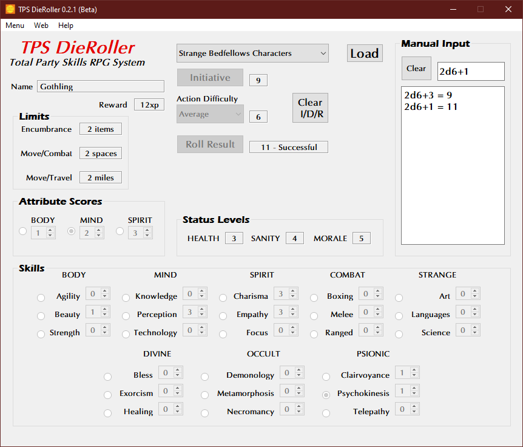

**Total Party Skills RPG Die Roller**
=====================================

**Total Party Skills RPG Die Roller** is a Windows program for calculating die rolls using the Total Party Skills system.

Notes
-----

**Total Party Skills RPG Die Roller** is being developed using Python 3.9.7 and PyQt5.

Requirements
------------

* **Windows 10**

   It might not work in OSX or Linux.

* **Python 3.9.7**
   
   This code was written using the C implementation of Python
   version 3.9.7. Also known as CPython.

* **colorama 0.4.4**

   Because CMD may have some colored text messages for debugging invalid die rolls.
   
* **PyQt5 5.15.4**

   PyQt5 is the framework used for displaying the Window GUI and buttons, etc.

Warning
-------

This code will not work with **Python 2.7-**.

Not Using Python?
-----------------

You can always run the .EXE version for Windows 10 if you don't have the Python language installed.

The Total Party Skills RPG was written by R. Joshua Holland.
Copyright 2021 - 2022, Total Party Skills.
https://www.drivethrurpg.com/browse/pub/20325/Total-Party-Skills

Contact
-------
Questions? Please contact shawndriscoll@hotmail.com
