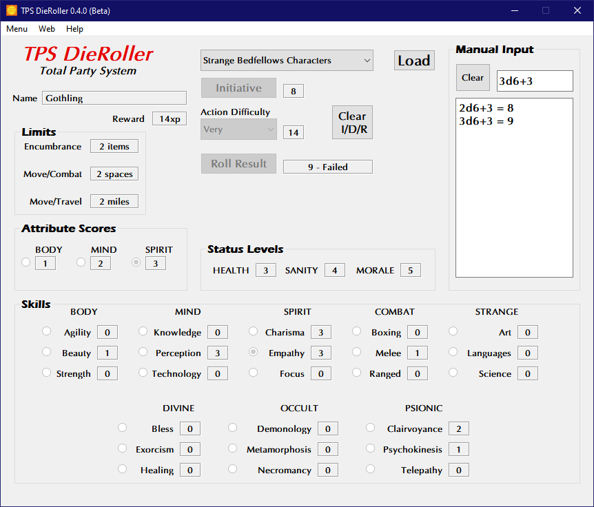

**Total Party System Die Roller**
=================================

**Total Party System Die Roller** is a Windows program for calculating die rolls using the Total Party System.

Notes
-----

**Total Party System Die Roller** is being developed using Python 3.11.4 and PyQt5.

Requirements
------------

* **Windows 10**

  It has not been tested in Windows 11.

* **Python 3.11.4**

  This code was written using the C implementation of Python
  version 3.11.4. Also known as CPython.

* **PyQt5 5.15.9**

  PyQt5 is the framework used for displaying the Window GUI and buttons, etc.

Not Using Python?
-----------------

You can always run the .EXE version for Windows 10 if you don't have the Python language installed.

.. |ss| raw:: html

    <strike>

.. |se| raw:: html

    </strike>

Things To-Do
------------

| Continue unifying the skills across all TPS genres.
| Instruction manual.
| Cheat codes.
|ss|

| Add/borrow psionics check for future use from We Want Soviet Men!
| Add Encumbrance rules from Rocket Cadets in the 11th Dimension!
| Start on a To-Do.

|se|

**Known History**

* v0.4.1b

  Using an updated Python, pydice, and PyQt5.

* v0.4.0b

  Updated to Python 3.11.0.

* v0.3.0b

  Replaced all the GUI QSpinBox objects with QLabel objects. QSpinBox objects ended up not being needed for this program.
  
  Undisabled fields that didn't need disabling. Easier on the eyes now.

* v0.2.1b

  Added checks when loading characters with psionic skills.
  
  Now recognizes psionic characters from Strange Bedfellows.

The Total Party System - Universal RPG was written by R. Joshua Holland.
Copyright 2021 - 2023, Total Party Skills.
https://www.drivethrurpg.com/browse/pub/20325/Total-Party-Skills

Contact
-------
Questions? Please contact shawndriscoll@hotmail.com
